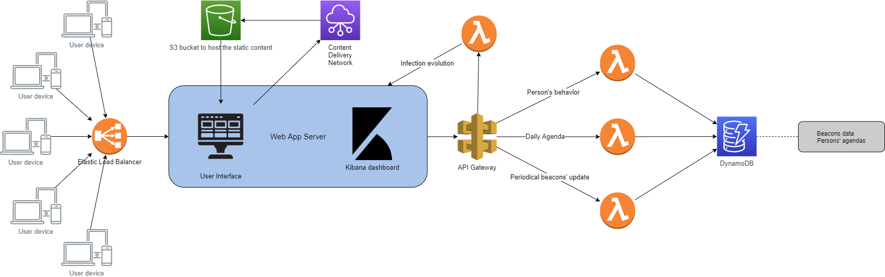

# Cloud Computing Project #
This is the repository for the Cloud Computing project.

## Project First Draft  ##
### Functionality & Scope ###
The goal of our application is to simulate the behavior of a virus outbreak within the population of a given location. It will receive a list of parameters from the user, which it will use for setting up the simulation environment. Parameters to be received are the following:
-    Duration of the following virus stages:
    -   Incubation Stage
    -   Symptomatic Stage
    -   Duration of the infection fight
-	Mortality rate
-	Mean number of transmission events per hour
-	Duration of the simulation

After the user inputs such parameters, simulation will run for the defined period of time, during which a diagram will display the evolution of the virus outbreak. Users will have the opportunity to analyze how the spread of the virus is affected depending on certains parameters he/she defines. The logic behind how the simulation works is as follows:   
There’s a certain amount of actors (students, workers, elderly, etc…) within a location (housing , office, school, university, medical, recreational and transportation). In order for the virus spread to begin, we will define one of these actors as the “patient zero”. Such actors will have a defined agenda of activities that will be performed daily. These activities may vary (attending to school, work, supermarket, park, etc…).During these activities, the actors will change their location, therefore being exposed to have an interaction with other actors who may be infected. Those interactions will be recorded with anonymous keys (beacons) and eventually, once another actor is flagged as infected, its interactions with others will be retrieved to understand who else could get infected as well. As the simulation continues, the infected actors will go through the different disease stages, and eventually become cured or die.

### Resources and services required to build the solution ###
The whole architecture of our project can be divided in the following sections. For each of them, different AWS products and services will be used in order to provide the cloud infrastructure needed.
#### Project Management ####
In order to advance on the project development, the tools that have been chosen to work are:
-	Github
-	Google Docs
-	Google Hangouts
-	Trello
#### Web App Hosting ####
In order to make the web application available, Elastic Beanstalk will be used. This will handle the load balancing of the requests for every time the simulation is run. Furthermore, allowing us to have a “serverless” architecture that will handle as many requests as needed, while also providing fault-tolerance over the web interface.
#### User Interface ####
The static content (web app code) will be stored in multiple S3 buckets and will be delivered by using a Content Delivery Network (CDN). In this way, we will make the web app faster accessible from the various availability zones, as the static content will be stored closer to the users.
#### Simulator Logic ####
With regards to the actual simulation of the infection spread, AWS Lambda functions will be used to handle all of the requests that will be done to the database (GET, POST, PUT, DELETE, etc.). In order to call these Lambda functions, an AWS API Gateway will be hosted, which will interact with the requests from the application; this will also allow us to handle a simulation for a bigger size population.
#### Storing data ####
As several AWS products are already going to be used, in order to store data, the DynamoDB service will be used.
  Our first estimation is that most of the data will be stored in documents inside the DynamoDB as JSON files. This option will give us more flexibility, as we will have a schemaless database that can store all the required information.
  Specifically related to the location data (spatial) the intention is to utilize the Elastic Maps Services. Such information will model a defined location and attempt to reflect the mobility of the population within that location.
#### Plotting and showing results ####
Kibana will be the main tool used for plotting the desired information regarding the virus outbreak evolution.
  The results of the simulator will be sent directly from the simulator (with the use of a Lambda function) to the Elasticsearch in order to be used by Kibana.
  A draft of the tentative architecture is depicted in the image below.
###### Product Architecture

### Intended use of the 200 hours for all the main tasks of the project ###
| Activity | Description  | Hours Assigned   |
|-----------------------|---|---|
| Project Management    | <ul><li>Team Meetings</li><li>Sprint Planning</li></ul>  |  50 |
| Architectural Design  |   |5|
| Deliverables          | <ul><li>Final presentation</li><li>Final report</li></ul>   |10|
| User Interface        | <ul><li>Elastic Beanstalk host</li><li>UI development/coding</li><li>S3 bucket configuration</li></ul>  |25|
|DynamoDb|<ul><li>DynamoDb development</li></ul>|5|
|Lambda Functions|<ul><li>Research on lambda functions</li><li>Lambda functions development/coding<ul><li>People behavior</li><li>Daily agenda</li><li>Beacon updates</li></ul></ul>|30|
|Batch operations|<ul><li>AWS command research</li><li>Batch files development</li></ul>|20|
| Kibana                | <ul><li>Connection to database</li><li>Connection to UI (Visualization method)</li><li>Plots generation</li></ul> |30|
| Testing               |   |25|

### Tentative content index of the final report ###
-   Detailed product description
-   Description of the changes that we made from the 1st draft
-   Architectural design
-   Used components
-   Twelve-factor methodology justification
-   Team Management
    -   Creation and distribution of the stories
    -   Meetings
    -   Methodologies for (remote) pair programming
    -   List of the used tools
    -   Working environment
        -   Development
        -   Production
        -   Staging
-   Encountered problems and solutions related to
    -   Coding and product functionality
    -   Team management
    -   Cloud services and resources
    -   Other problems that we may faced
-    Cloud service justification
-    Hours invested per team member
