# Tutorial: Get Started with MongoDB Atlas
In this tutorial you will experiment with [MongoDB Atlas](https://www.mongodb.com/cloud/atlas) and you will use some of its 
services. MongoDB Atlas is a global cloud database service for modern applications and specifically it is Database-as-a-Service 
(DBaaS).
</br>
MongoDB Atlas is able to provide all the capabilities that [AWS DocumentDB](https://aws.amazon.com/documentdb/) can provide but 
it also introduces more automation that makes the management of many MongoDB clusters easier. In addition to that, MongoDB Atlas 
offers competitive prices, significantly lower than those of AWS. It also gives a Free Tier (M0) that we will use to do this lab and that can be used as testing environment for your future applications.

## Create an account and deploy your first MongoDB cluster
1) Follow [this link](https://www.mongodb.com/download-center) and create an account using your email.
2) In the next page, choose the free tier to continue.
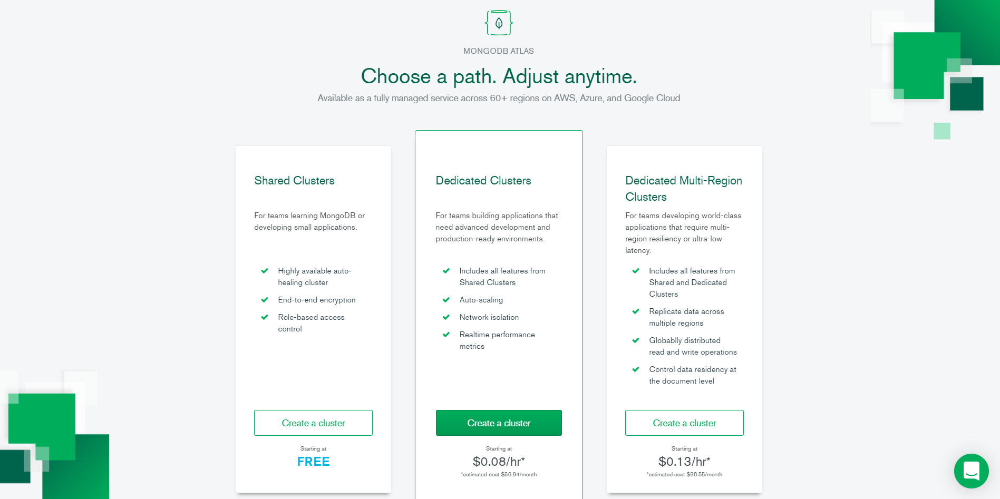
3) Choose **AWS** as Cloud provider and **us-east-1** as region and give a name to your cluster. Leave the default values for the 
rest of the settings.
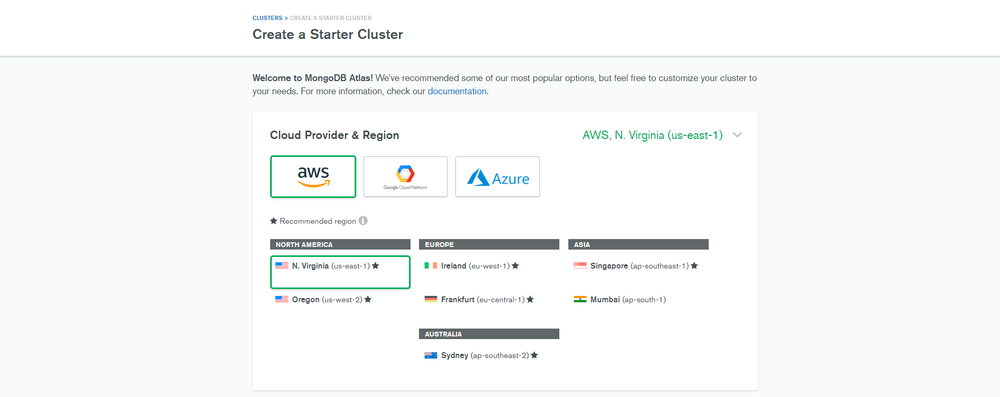
4) In the pop up window, choose to continue without upgrading your account and wait a couple of minutes for your cluster to be 
deployed. If everything is okay, your dashboard will look like the following.
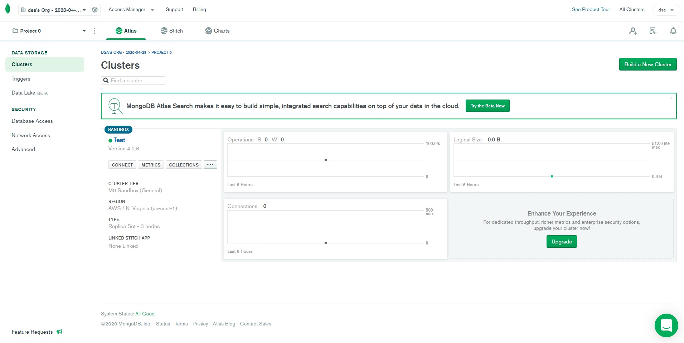

## Configure your Security features
### Create a Database User for Your Cluster
In the main dashboard of your account, under **SECURITY** tab on the left-hand, click **Database Access**.
</br>
</br>
On the right, click to add a new database user.
</br>
Create **2 users** with different roles. One user that has **administrator rights** and 
another one that has **readOnly rights**. Give the names **admin** and **readOnly**, respectively.
</br>
**Remember to save the credentials that you will provide as we will need them later!**
</br>
</br>
Keep in mind that both roles are applied by default to all the databases in your account. 
We will see later in this tutorial how we can further customize the given privileges.
</br>

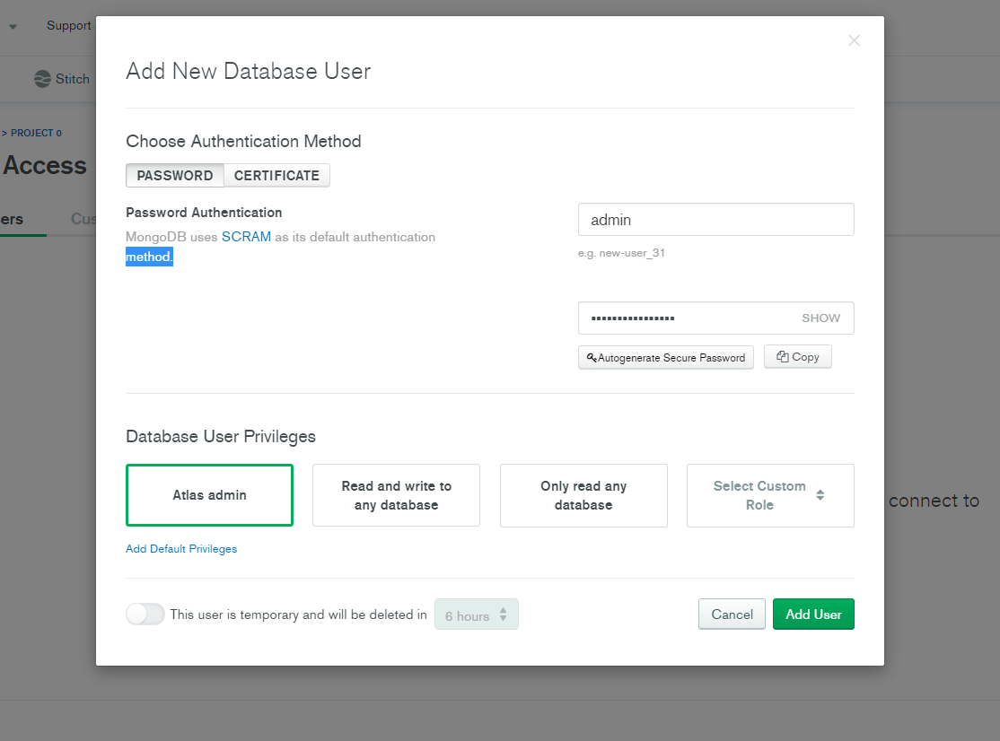
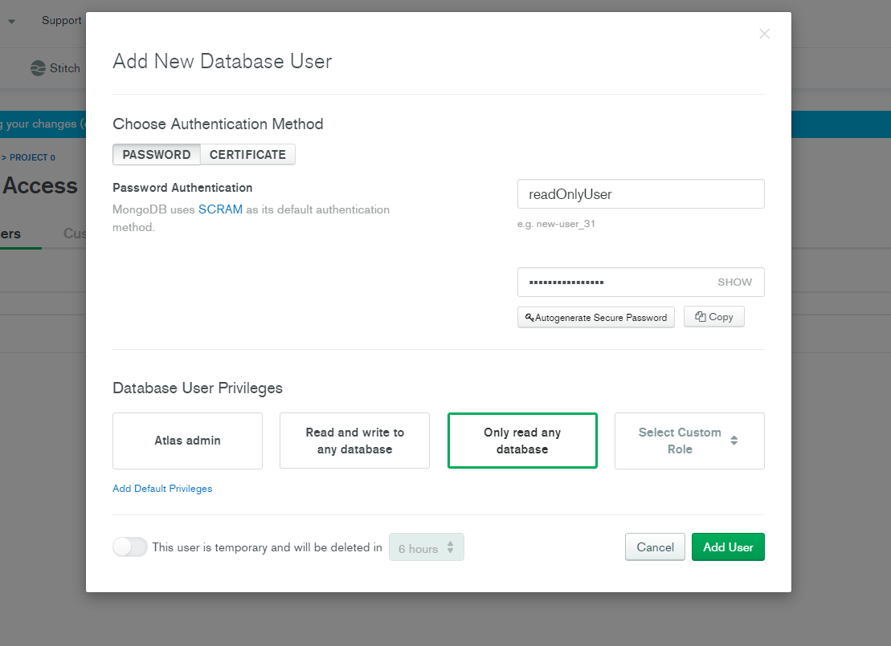

### Whitelist Your Connection IP Address
Apart from the Authentication layer, Atlas adds a Network access layer that allows you to manage the IP addresses from which your 
databases can be accessed. You can configure the allowed IP addresses from the **Network Access** tab on the left-hand of the dashboard.
In this tutorial we will create an IP Whitelist that defines the IP addresses that will not be banned. Atlas also provides other methods
of Network configuration such as [Peering](https://docs.atlas.mongodb.com/security-vpc-peering/) and [Private Endpoint](https://docs.atlas.mongodb.com/security-private-endpoint/).
</br></br>
Press the green button to **Add IP Address**.
</br>
In the popup window you can either add your current IP address or allow access from anywhere. For this tutorial you can choose the 
first choice. If you want to give access to everyone that has the required credentials, you can allow access from anywhere.
</br>
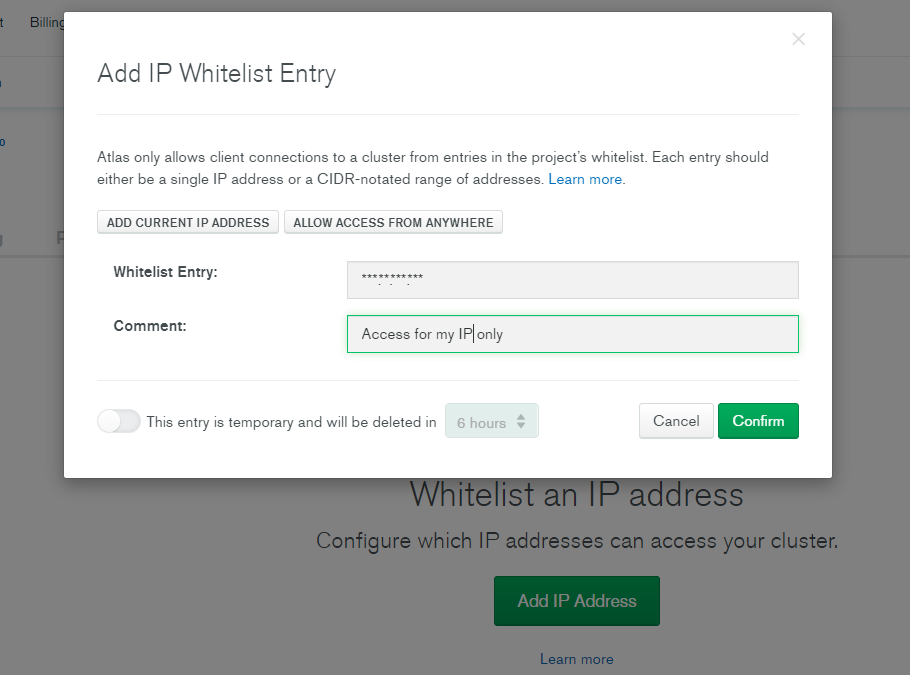

### Create a Custom Database User for Your Cluster
A good practice that we should follow when we are developing applications that have different user roles, is the **principle of least privilege** 
, also known as the **principle of minimal privilege**. According to this principle, each module of our application must be able to access only the information and resources that 
are necessary for its legitimate purpose. This strategy can be extremely useful in case that our code has vulnerabilities that can 
be exploited by people who want to get more privileges that the one they have. By restricting their access in a database level, even 
if they find such vulnerabilities, they will not be able to use them as they will not have the rights to read/modify the database.
</br></br>
To create custom user roles, go to the **Database Access** tab and click on **Custom Roles**.
</br>
Create a new role that will grant **read and write** permissions only for the collection **car** that is stored in the 
**tutorial** database.
</br>
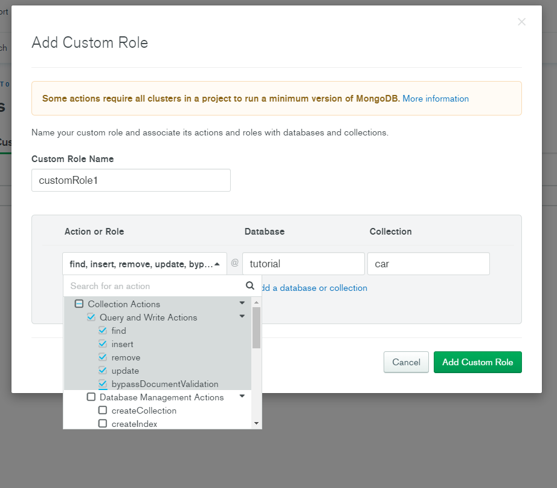
Now go back to the **Database Access** tab and create a new user named **tutorialUser** that has the newly created role.
</br>
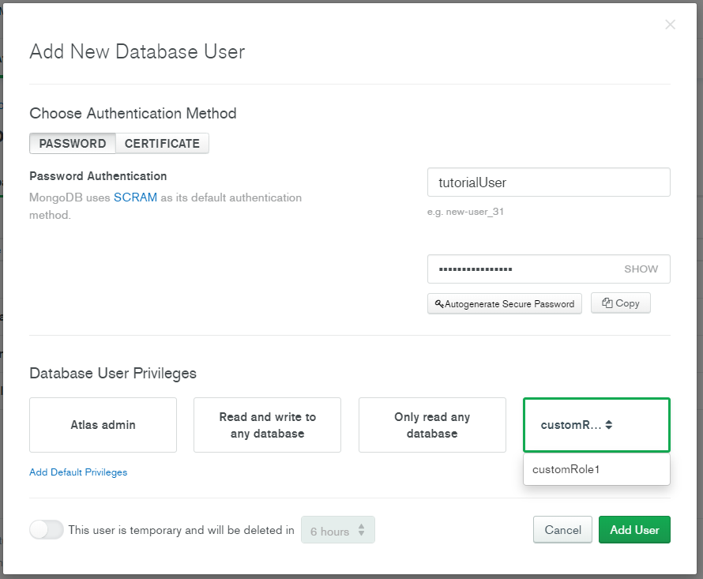

## Insert and Access Data in your Cluster
In this part of the tutorial we will see how we can load documents in the MongoDB cluster and how we can consume them using a 
driver. Drivers allow you to interact with your databases programmatically using one of several available programming languages. 
For this tutorial we will use **PyMongo driver** with Python. For a complete list of MongoDB drivers, see the [driver documentation](https://docs.mongodb.com/drivers/).
</br>
</br>
First of all, you need to download the connection string and configure it correctly in order to connect to your cluster. To do so, 
navigate to your dashboard and click **Clusters** button on the left. There, you should be able to see your cluster and its status.
</br>
Click **CONNECT** and then **Connect to your application**. Make sure that the selected driver is set to **Python** and the Version to **3.6 or later**.
Copy the **Connection String** and paste it to your notepad.
</br>
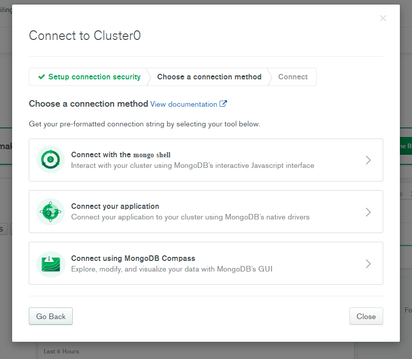
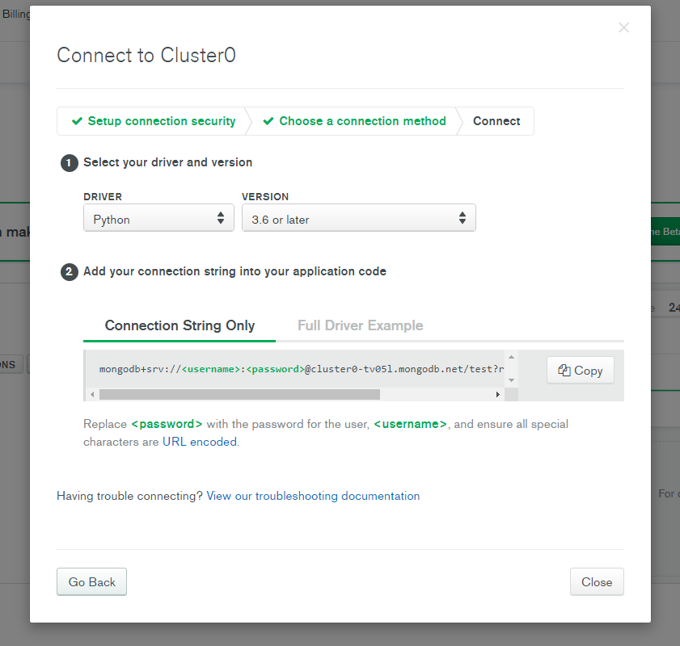

After saving the connection string, you will need to install the PyMongo driver by running the following command. You can use a virtual environment.
`python -m pip install pymongo`.
</br>
</br>
Copy and Paste the following python code in the Python IDE of your choice. Before running the code, create an environment variable 
with name **MONGO_CLUSTER** and value the connection string that you previously saved, by replacing **\<username\>** with **admin** and **\<password\>** with the password that you gave for this user.
```py
import os
import random
from pymongo import MongoClient

MONGO_CLUSTER = os.getenv('MONGO_CLUSTER')
client = MongoClient(MONGO_CLUSTER)
db = client.tutorial
population = db.population

infection_status_list = ['susceptible']*round(2)+['infected']*round(3)+['infectious']*round(1)+['treated']*round(1)+['cured']*round(3)
documents = []

for id in range(0,100):
    agenda_type = 0
    infection_status = random.choice(infection_status_list)

    personDocument = {
        "person_id": id,
        "infection_status": infection_status,
    }
    documents.append(personDocument)

population.insert_many(documents)
```
After successfully running the above program, navigate to your dashboard and press **collections** inside your cluster. 
There, you will be able to explore your databases and the collections inside them.
</br>
Go to the database named **tutorial** and click the **population** collection to view the data that you just imported.
Make sure that everything worked correctly and try to answer the following 3 questions.
</br>
</br>
**Question 1: Try to run again the same program by changing the connection string to use another user. Specifically, give as username the readOnly user and as password the password that you gave to this user. What is the error that you get? Why does this happen?**
</br>
</br>
**Question 2: Create a python script that this user will be able to run. Get the person_id of the documents that have infection_status: "infected".**
</br>
</br>
**Question 3: What is going to happen when you use the tutorialUser that has the custom role. If this user has not the required privileges to run the program of Question 2, try to modify its rights according to the principle of minimal privilege.**

## Database Triggers
Triggers allow you to execute server-side logic in response to database events or according to a schedule. Atlas provides two kinds 
of Triggers: **Database and Scheduled** triggers. Database triggers allow you to execute server-side logic whenever a document is added, 
updated, or removed in a linked cluster. On the other hand, scheduled triggers allow you to execute server-side logic on a regular schedule 
that you define. In this tutorial, we will experiment with Database triggers.
</br>
</br>
To create a trigger, navigate to the left-hand of your dashboard and press **Triggers** under the Data Storage section. In the new 
window, you can create a list of triggers that will automatically manage changes to your database.
</br>
While you are creating a trigger, you can define whether it will be a Database or a Scheduled one, its name, the cluster, the database 
and the collection to which it will be attached and finally the **JavaScript** code that will be executed whenever this trigger is activated.
</br>
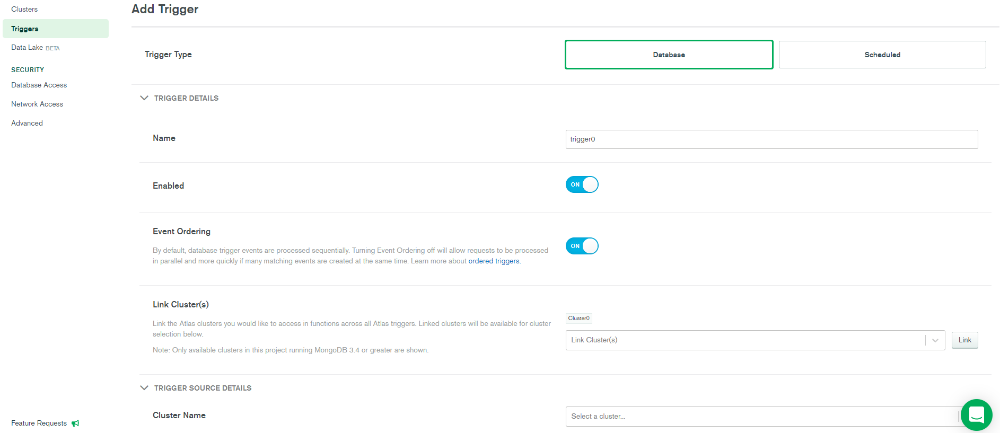
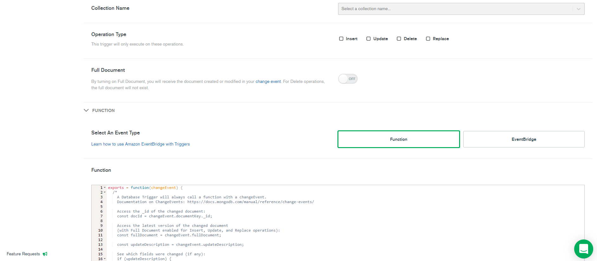

After having created your triggers, you can go back to the **Triggers** tab and see an overview of your triggers as well as the logs 
generated. Every time that a trigger is called, a new log record is generated in the **Logs** tab.
</br>
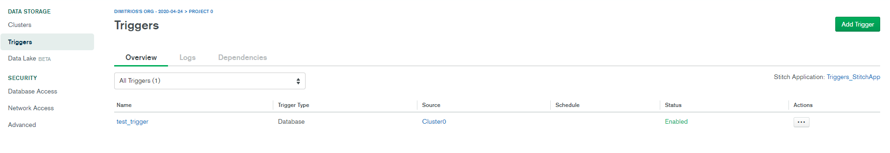
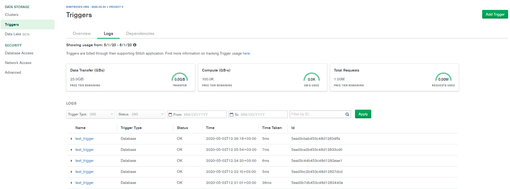
</br>
</br>
**Question 4: Create a trigger for the previously created cluster that will check the correctness of the data in your population. Specifically, every time that an invalid infection status is inserted in your population collection, write the person_id and the wrong value that was inserted. The valid values for the infection status are: 'susceptible',  'infected', 'infectious', 'treated' and 'cured'.**
</br>
</br>
**Question 5: After having your trigger enabled, try to insert a document with an invalid infection status and check the logs. In addition, instead of inserting, try to update the infection status to a wrong value and check the logs again.**


## Creating and using a Data Lake in MongoDB Atlas

In this section we will see how to leverage another important feature of MongoDB Atlas: The Data Lakes. When it comes to dealing with huge amounts of data, which are also available in different formats, the go-to option are data lakes. This approach allows you to store your data in a raw manner, and to perform different tasks (reporting, analytics, visualization, etc.).

MongoDB Atlas Data Lakes provides a way of creating, connecting and querying your own data lake in an S3 bucket, which can contain files in several formats (CSVs, TSVs, Avro, Parquet, JSon and BSon). 

### Creating the S3 Bucket
The first step is to create an S3 bucket. In order to be able to query the different formats, one folder per format has to be created. Inside those folders, we'll need to create one folder per collection. You can use the dataset available [here](https://drive.google.com/file/d/1IUdBeAV1IaFmuJXs1IITSLa3NCc_tuyx/view?usp=sharing) to populate your data lake. The structure of your S3 bucket will look like this:

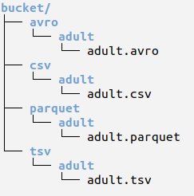

### Creating the Data Lake in Atlas
The second step in this section will be the creation of the actual data lake. In order to do that, and once we know our bucket's name, we will go to the Data Lake section under the Data Storage menu (the column on the left).

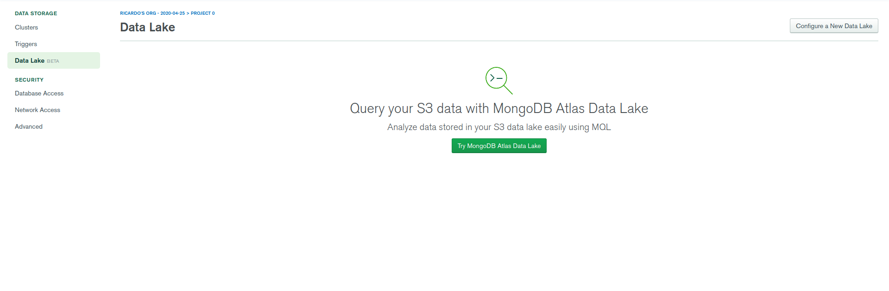

Once here, we will press "Configure a New Data Lake", which will open a wizard with rather straightforward instructions. One of the steps of the wizard is creating the AWS IAM role for accessing the S3 bucket from Atlas. If you have the aws cli already installed, you will only need to copy and run the commands given. Once completed the wizard, you will see a menu like the following one:

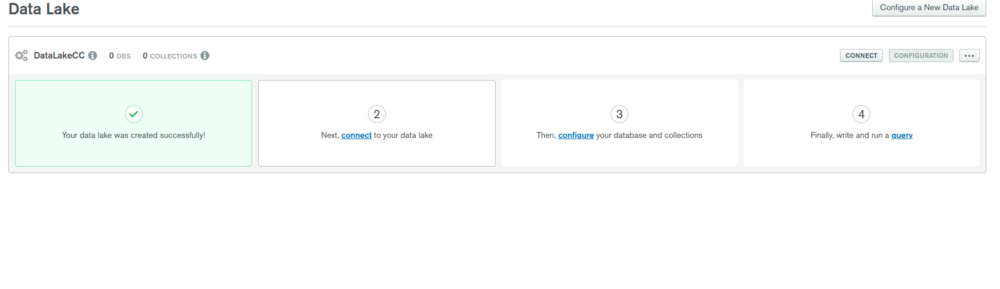

The next step will be connecting to your data lake. There are several options to connect to the data lake. We will rely on the mongo shell. Open the "connect to your data lake" wizard and follow the instructions. You will need to modify the command provided with the info from your admin user and password.

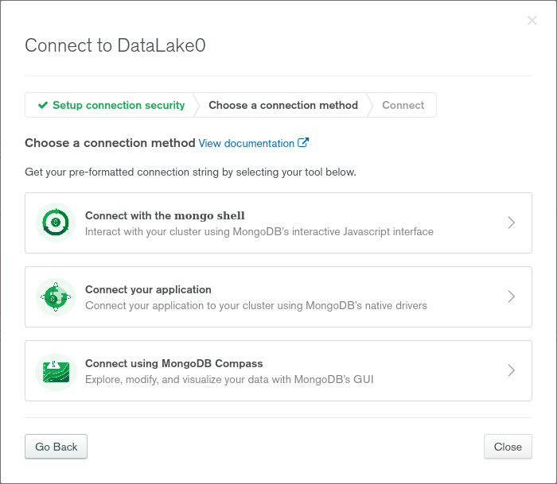
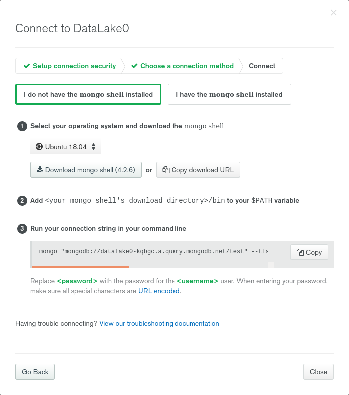

Once we have our mongo shell opened, we will need to configure the data lake. This means creating a store, a database, the collections and adding the data sources. Use the following mongo shell instructions (insert your data lake information) to change the configuration.

```
use admin;
db.runCommand( { "storageSetConfig": {
  "stores" : [
    {
      "name" : "store_cc",
      "provider" : "s3",
      "region" : <your region>,
      "bucket" : <your bucket>,
      "delimiter" : "/"
    }
  ],
  "databases" : [
    {
      "name" : "test",
      "collections" : [
        {
          "name" : "adult",
          "dataSources" : [
            {
              "storeName" : "store_cc",
              "path" : "/avro/adult"
            },
            {
              "storeName" : "store_cc",
              "path" : "/parquet/adult"
            },
            {
              "storeName" : "store_cc",
              "path" : "/csv/adult"
            },
            {
              "storeName" : "store_cc",
              "path" : "/tsv/adult"
            }
          ]
        }
      ]
    }
  ]
}})
```

Once done this you will get an ok message and you will be ready to do queries.

**Question 6: Retrieve the number of people per country. Retrieve also the total number of people. How many people are there in the csv and the tsv files? (you can use the `wc -l` command to obtain this information). Can you know how many people are there in the avro and parquet files?**

**Question 7: Try to do some queries. For example, get the average capital gain per country.**


