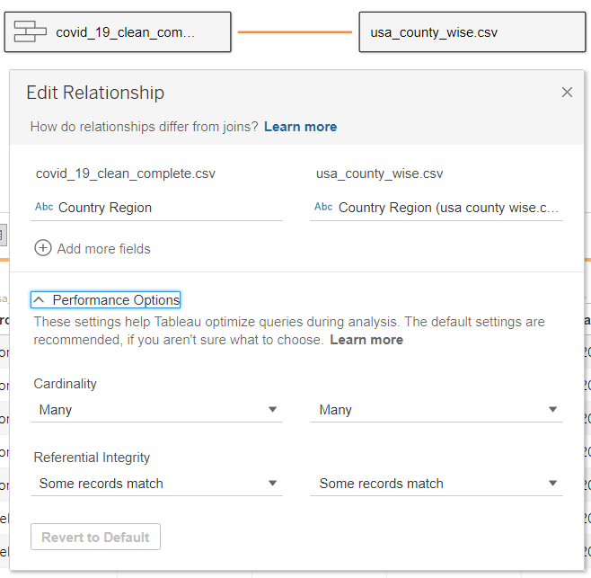
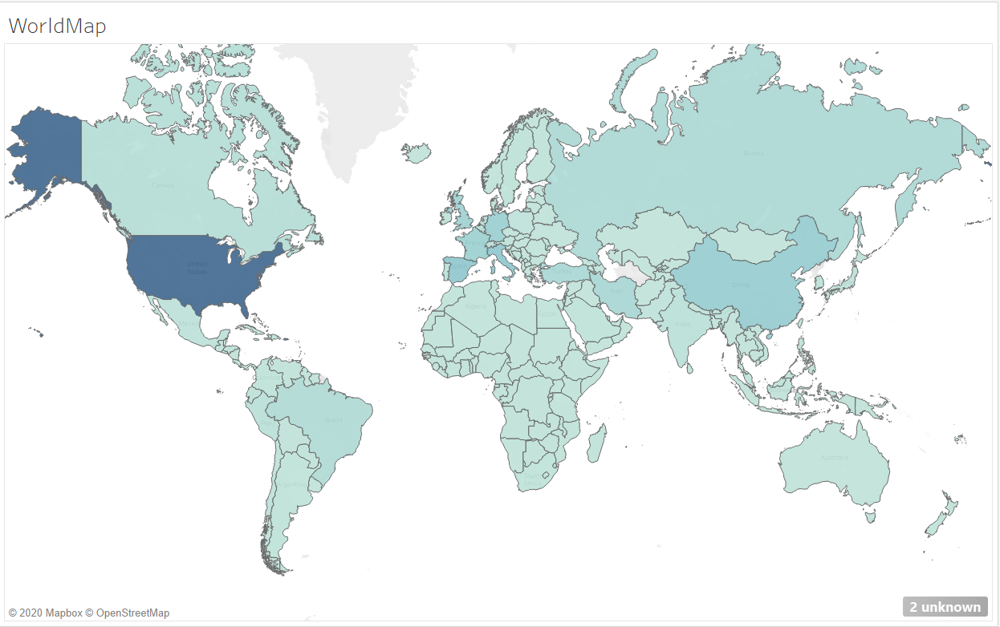
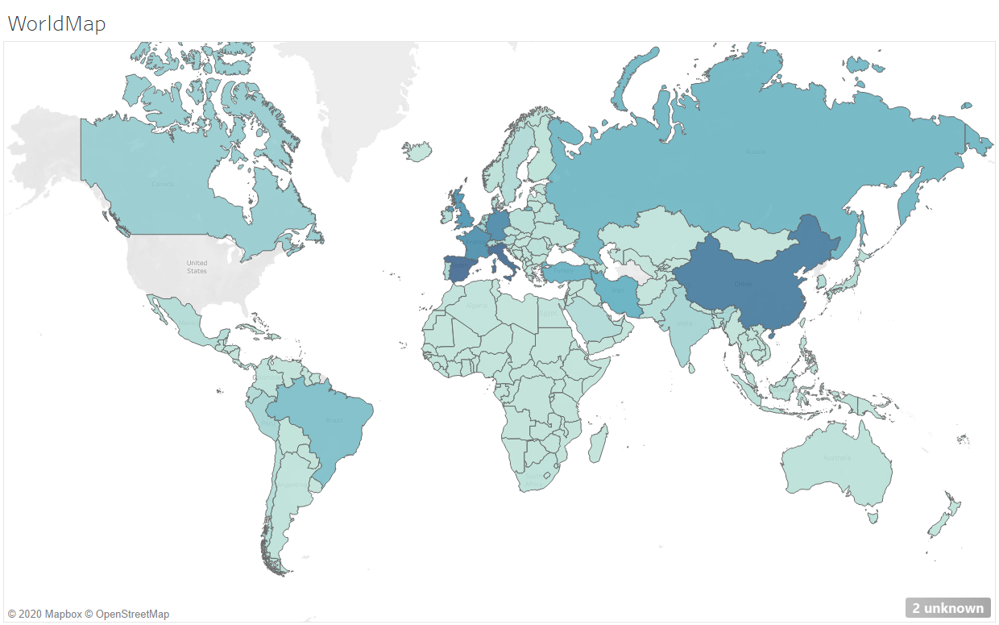
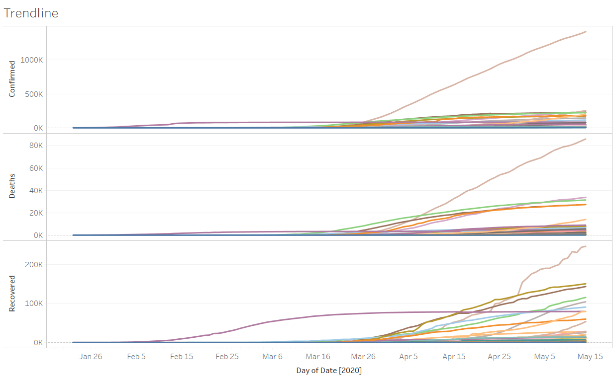
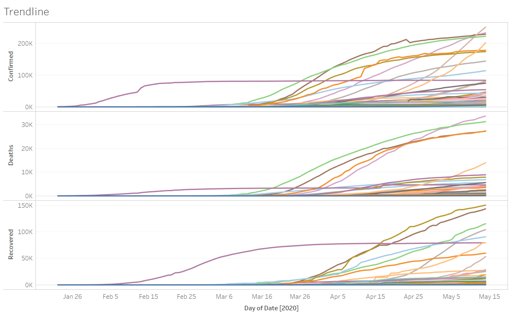
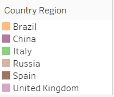
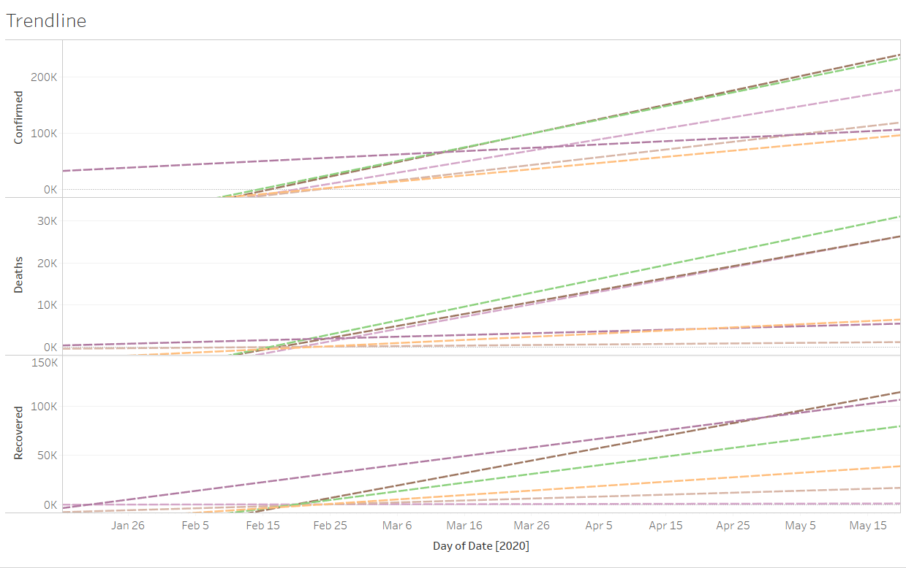
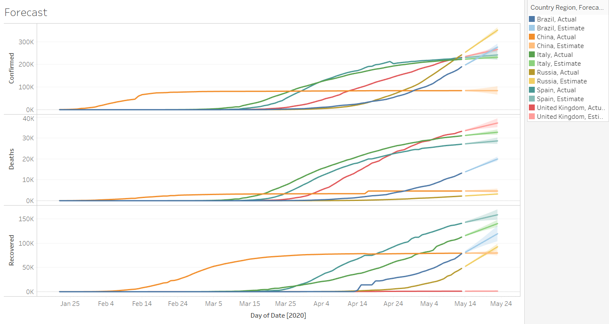
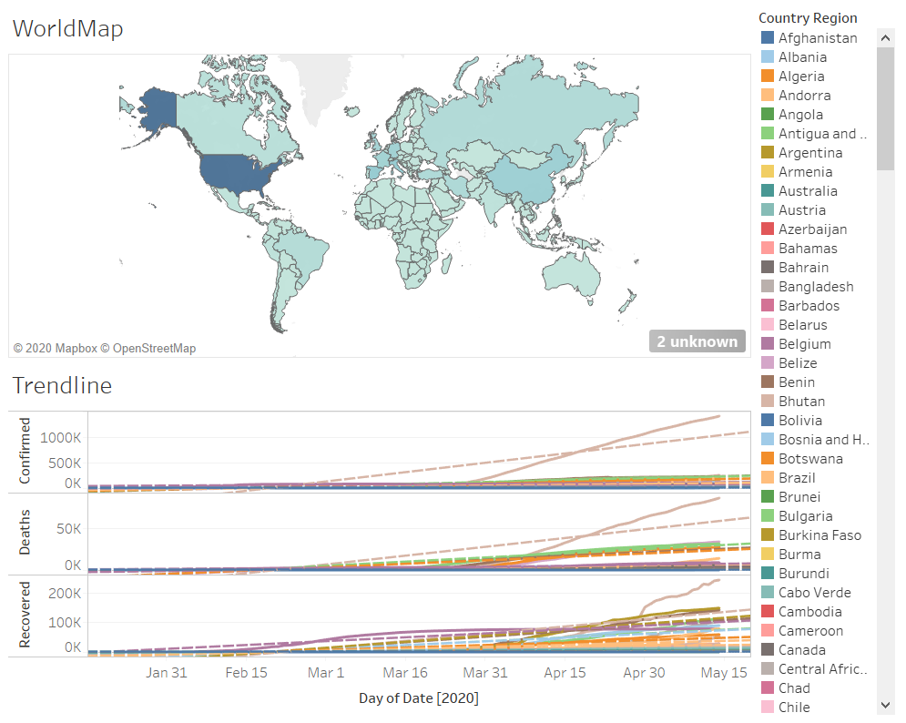
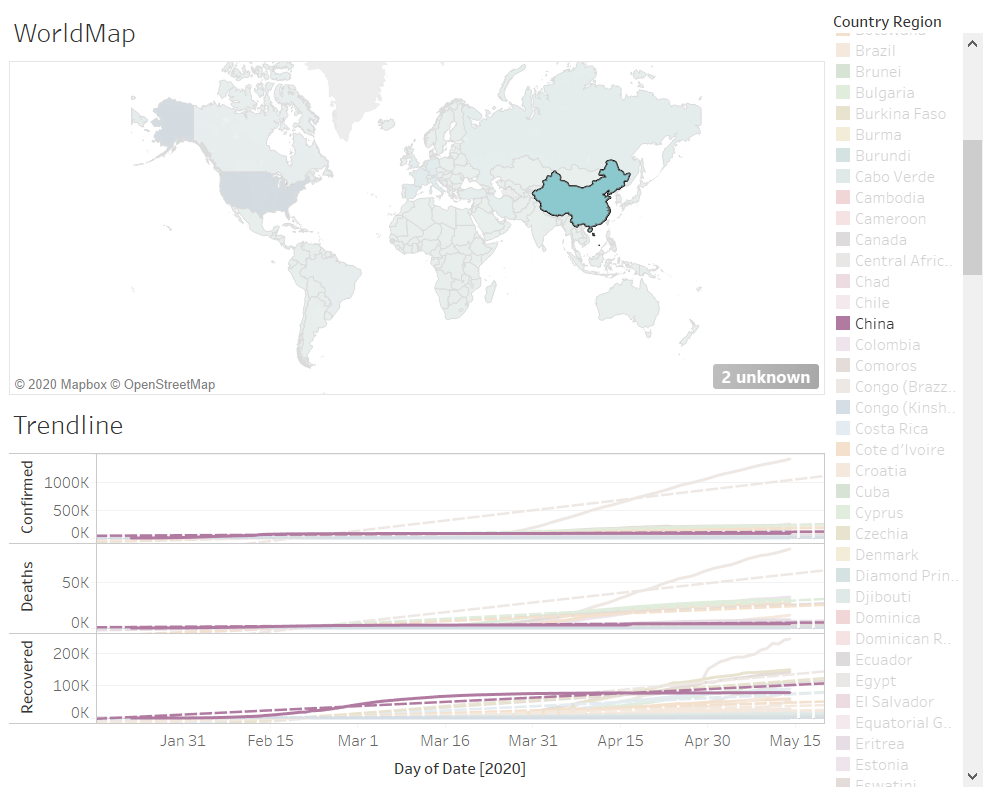

## Explore Data with Tableau ##
### 7.1 Load data into Tableau ###
During the lab the first thing asked for us to do is load the data set from the coronavirus spread located in Kaggle to work with it within the tool. Evidence of the data loading can be seen in the image below:

Important to note that depending on the version of Tableau installed, the process of joining both CSV files differs. 
While in previous versions, the files were uploaded and the only option for linking them was utilizing a join, the new version provides a functionality called "Relationship", where you can do 1:1, 1:many or many:many relationships.
We utilized the new version of Tableau, thus were able to create the relationship between both data sets by the Country and Date.  
After analyzing the data within the tool, we see some inconsistencies between both data sources: 
- The data from [covid_19_clean_complete.csv](img/covid_19_clean_complete.csv) is dirty in the sense that some countries display the accumulated number of cases per day, while for other countries it displays the number of cases on that specific day.
- [covid_19_clean_complete.csv](img/covid_19_clean_complete.csv) already contains data from the US, thus the use of the relationship between this file and [usa_county_wise.csv](img/usa_county_wise.csv) is unnecessary.
- [usa_county_wise.csv](img/usa_county_wise.csv) contains an unrealistic number of cases for the US. The total sum of the cases gives 38,292,790 confirmed cases, which is not the true number for the country. This due to the same problem as the previous file, where some counties display data accumulated and others per day.

We will continue using both data sets to be in-line with the research instructions.

### 7.2 Create a WorldMap ###
With the data loaded, now the intention is to generate a world map graphic where you can identify the different locations where cases have been present.

The lab showed a different map per day, but it doesn't make sense to analyze it in that sense, as we would need to se multiple maps to make sense of which is the country with the most cases up-to-date. 
Therefore we adjusted such by displaying a single map for the whole data set and duration. 
- It appears the data set is not accurate, as we can see US with the highest number of cases, with around 38 million.
- After US, countries like China, Spain, and Italy have the highest number of cases confirmed.

### 7.3 Create Trendlines ###
Next, we generated a line graph to analyze the behavior of the cases for each country. Again, because the US numbers are incorrect, the graph appears irregular and the US has a big difference compared to the other countries.

After filtering the US, we can make a better comparison of the countries with the highest numbers after the US.

If we want to analyze further, we need to filter some of the countries with few cases and that way we can generate the trend lines. The correct way to introduce trend lines within Tableau is through the **Analysis -> Trend Lines -> Show All Trend Lines** path. After inserting such, following is the result:  

In order to see only the trend lines, you must set the "Opacity" of the line graph to 0%. Following are some observations of the trend lines:
- We can see that all countries have an increasing trend for Confirmed, Deaths, and Recovered.
- The country that appears to be stabilizing the most is China, while the others have a very similar trend regarding the Confirmed cases.
- United Kingdom appears to have a neutral trend for recoveries, meaning the amount is going to be constant moving forward.

### 7.4 Create Forecast ###
Now we will analyze the forecast provided by Tableau for the countries selected earlier. After applying the forecast to the sheet for 1 month, we see the following results:

Following observations of the forecast:
- It appears that countries like Italy, China, and Spain have a forecast that could possibly become a negative trend in the Confirmed cases.
- Besides United Kingdom and Brazil, it seems all other countries have a forecast for decreasing the number of deaths as well.
- All countries except China and United Kingdom have a positive forecast for the number of Recovered cases.

### 7.5 Create Dashboard ###
After having our sheets ready, we can generate a dashboard combining them to make a more complete analysis. Following would be the result dashboard of combining the world map with the trend lines:

An interesting feature that dashboards in Tableau have is that you can create **Actions** that allow you to link one sheet to another. That way if you select a country for instance, the other worksheet would filter the data to present only that countries data. The instructions for creating such actions are go to **Dashboard -> Action -> Add Actions-> Highlight**, then select at top the source sheet and select down the target sheet.  
At the end you should be able to apply interactive filters to the dashboard, as the example shown below:

### Observations regarding the research ###
Overall, it seems a very basic lab regarding the use of Tableau as a Business Intelligence (BI) tool. Although the research at the beginning shows interesting comparison of Tableau against other BI tools, this is not very related to Cloud Computing overall. It could've been more interesting to explore how to deploy a Tableau Server within AWS assets, connecting maybe to an Amazon S3 instance, Amazon Aurora, or any other data source from the multiple options Tableau provides, as explained in this link: [AWS and Tableau](https://www.tableau.com/solutions/aws).  
The use of the tool also wasn't very extensive. Tableau is a very well developed BI tool which has many possibilities, from running queries to extract data from databases, to generating very powerful and interactive dashboards utilized by organizations. There's interesting scenarios where Tableau can connect even to NoSQL databases, like MongoDB. An example is provided in the following link: [Tableau and MongoDB](https://www.tableau.com/about/blog/2015/6/tableau-mongodb-visual-analytics-json-speed-thought-39557).
Again, it appears as a basic research on what Tableau is and a simple use case utilizing external data related to the current environment. A more clean data set could be used and further functionalities of the tool explored.  

**Grade provided: 7**