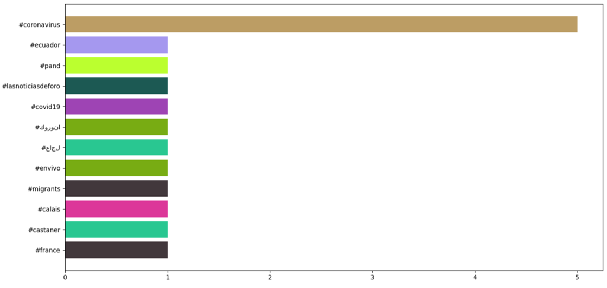
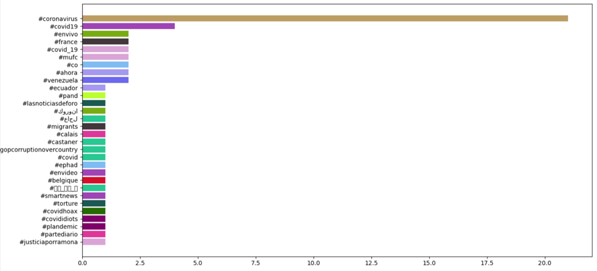
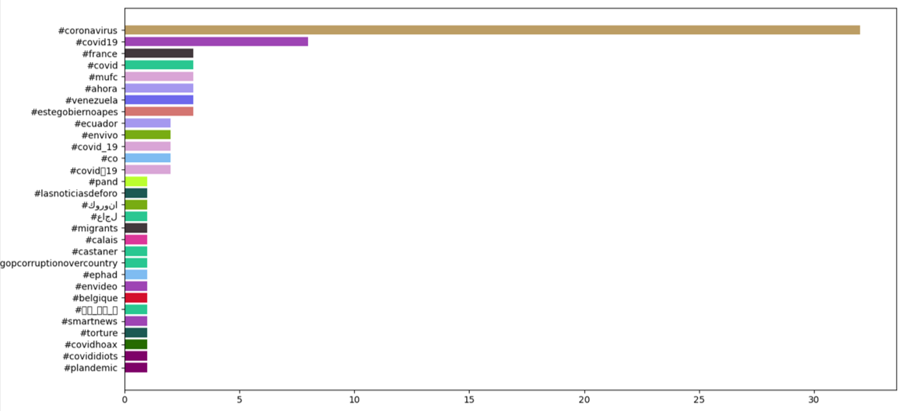
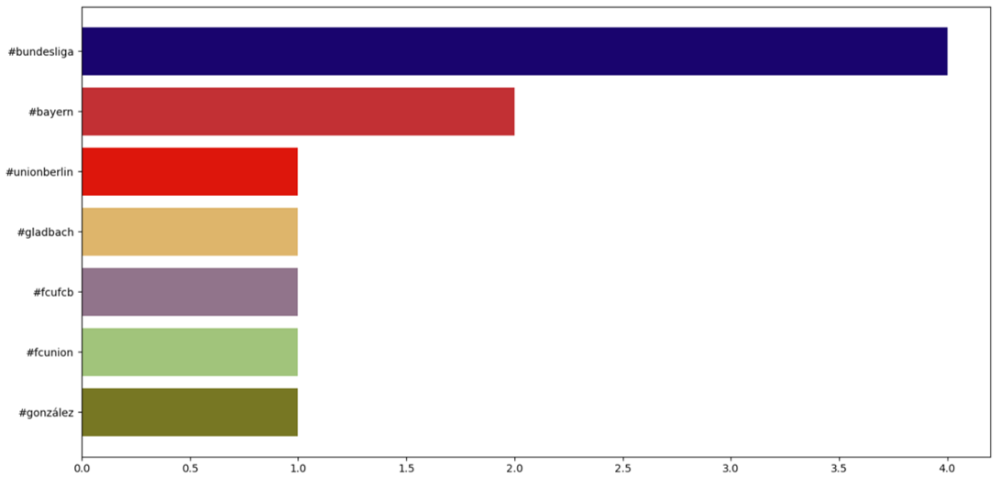
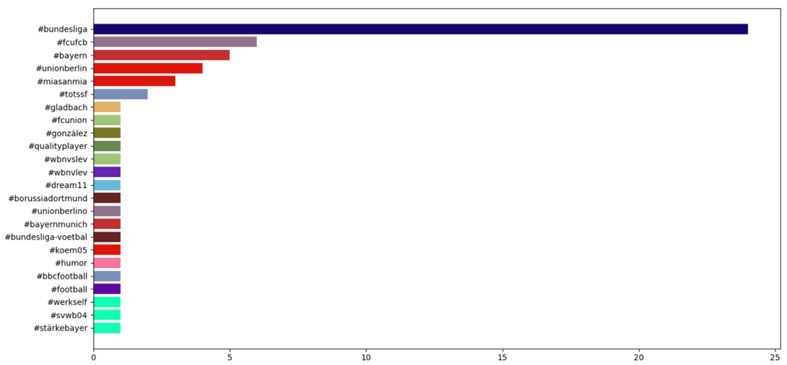

## Kafka: What is it? How can it help me? ##
### Requisites: Setting up the environment. ###
A new environment was created in Anaconda to fulfill the prerequisites established in this tutorial.

After downloading the Kafka binaries, we followed the [Apache Quickstart Guide](https://kafka.apache.org/quickstart) to make sure that both Zookeeper and Kafka were running correctly. The following commands were used to start the servers:

- Zookeeper
```
> bin\windows\zookeeper-server-start.bat config\zookeeper.properties
```````

- Kafka
```
> bin\windows\kafka-server-start.bat config\server.properties
```

An error appeared while starting the Kafka server, but after some research online, we discovered it was caused by the java version used by the *.bat file. To change this, it was necessary to update the "Path" environment variable to make sure the java path pointed to a Java version for a 64-bit architecture. In out particular case, this was the change performed:
- Original Path:
```
C:\Program Files (x86)\Common Files\Oracle\Java\javapath
```
- Updated Path;
```
C:\Program Files\Java\jdk-13.0.1\bin
```

Once this was fixed, we were able to proceed with the tutorial.

### A simple publish-subscribe example. ###

In this section, the tutorial described the steps to run a _Kafka Producer_ and a _Kafka Consumer_.

A subset of the results from running the _Kafka Producer_ are shown below:
```
(Kafka) Kafka_Tutorial> python producer.py
Sending {'number': 0}
Sending {'number': 1}
Sending {'number': 2}
Sending {'number': 3}
Sending {'number': 4}
Sending {'number': 5}
...
```

On the other hand, this is the result obtained from running the _Kafka Consumer_:
```
(Kafka) Kafka_Tutorial> python consumer.py
Receiving message
{'number': 0} received
Receiving message
{'number': 1} received
Receiving message
{'number': 2} received
Receiving message
{'number': 3} received
Receiving message
{'number': 4} received
Receiving message
{'number': 5} received
...
```

### Kafka Streams: real-time data ###
For the second part of the lab, we were asked to reuse some of the code implemented during the third lab session of the Cloud Computing class, where we extracted and analyzed data from Twitter. This time, however, we would use Kafka to produce and consume the tweets, instead of using a JSON file as an intermediary.

Although the changes that needed to be done to the code were already provided in the repository, one small update was added to the _consumer_live_plotting.py_ file. This change set every token to lower case, in order to group hashtags composed of the same letters but different use of upper and lower case (e.g. "Spain" and "spain"). The changes are shown below:

- Original:
```python
def preprocess(s, lowercase=False):
    tokens = tokenize(s)
    if lowercase:
        tokens = [token if emoticon_re.search(token) else token.lower() for token in tokens]
    return tokens
```

- Updated:
```python
def preprocess(s, lowercase=False):
    tokens = tokenize(s)
    j = 0
    for token in tokens:
        tokens[j] = token.lower()
        j += 1
    if lowercase:
        tokens = [token if emoticon_re.search(token) else token.lower() for token in tokens]
    return tokens
```

The original code proposed to track tweets using the word "coronavirus". As stated in the tutorial, running both the producer and the consumer at the same time showed a plot that simulated a "race chart", as it can be observed in the following images:

- Screenshot 1


- Screenshot 2


- Screenshot 3


We also decided to try tracking a different word to further take advantage of this implementation. This time, we changed the name of the topic to "football" in the Kafka producer and consumer and also decided to track the word "bundesliga", given that football games in Germany restarted recently. The results can be observed below.

- Screenshot 1


- Screenshot 2


### Observations regarding the research ### 
We believe Kafka was a solid choice for the tutorial, given that it was a technology not covered during the course and yet provided a different solution to a problem that we had already faced in a previous lab. However, reusing that problem has its downside as well, since it prevents us from identifying new use cases for this technology, and thus someone who feels more comfortable with the implementation developed during the third lab session would find it hard to justify the use of Kafka. The [Apache Quickstart](https://kafka.apache.org/quickstart) contains an easy to follow example showing some of the additional functionalities provided by Kafka; perhaps addressing them in the tutorial would have made it more relevant.

As for the tutorial itself, it was not quite clear what was meant by installing the Kafka binaries and how to confirm it had been done correctly or not; some images or further description would have helped more than just putting links to troubleshoot the potential issues. On a positive note, both of the examples provided were helpful to understand the basic functionality of Kafka, with the Twitter plot that was updated in real-time a highlight of the tutorial.

**Grade provided: 8**
